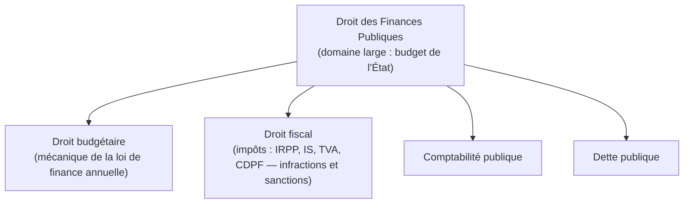
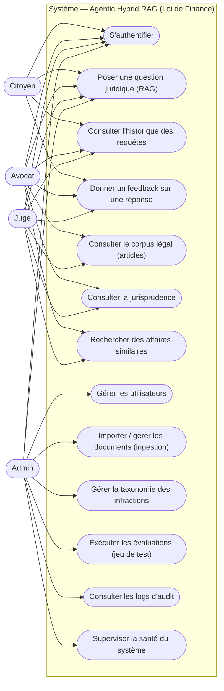
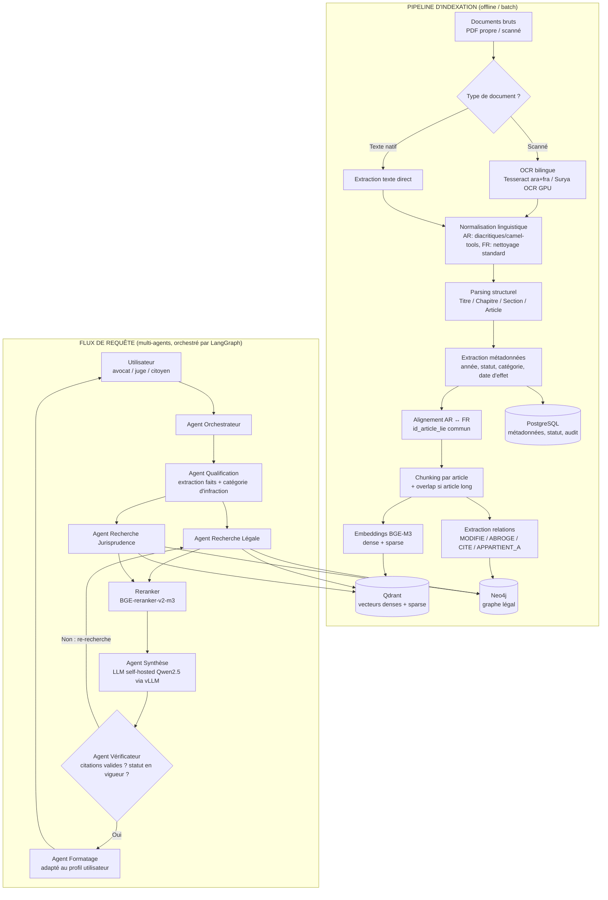
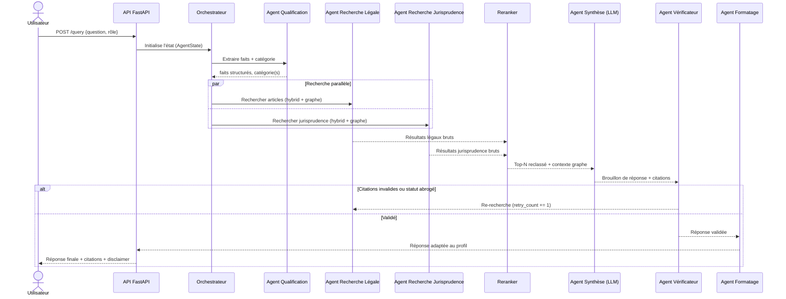

# Architecture — Système Agentic Hybrid RAG pour la Loi de Finance Tunisienne

## 1. Objectif du projet

Concevoir un système multi-agents (RAG hybride) capable d'aider **avocats**, **juges** et **citoyens** à comprendre les sanctions et implications légales liées aux infractions relevant de la **loi de finance tunisienne**, en s'appuyant sur :
- le corpus des lois de finance (textes officiels, par année),
- un corpus de jurisprudence / affaires passées collectées,
- un raisonnement multi-agents capable de qualifier les faits, retrouver les textes pertinents, retrouver des cas similaires, et produire une réponse fiable, sourcée et vérifiée.

**Périmètre strict (Phase 1)** : loi de finance uniquement (pas le code pénal général, sauf lien direct avec une infraction financière).

**Non-objectif** : ce système ne remplace pas un avis juridique officiel. Toute réponse doit être accompagnée d'un disclaimer et de citations vérifiables.

### 1.1 Clarification — composition du domaine "finance"

Le terme "finance" utilisé dans ce projet renvoie au domaine des **finances publiques**, qui se décompose en plusieurs branches :



- **Finances publiques** = le domaine large : gestion de l'argent de l'État (budget, dépenses, recettes, dette, comptabilité).
- **Fiscal** = une branche des finances publiques, centrée sur l'impôt (qui paie, combien, contrôle, infractions et sanctions — porté par des codes permanents comme le CDPF, le Code de l'IRPP/IS, le Code de la TVA).
- **Loi de Finance** = l'instrument juridique annuel qui organise le budget et qui, au passage, modifie souvent les règles fiscales (taux, exonérations). Elle touche donc à la fois au budgétaire et au fiscal, sans se confondre avec aucun des deux.

**Décision actuelle** : le périmètre du projet reste défini autour de la **loi de finance** (au sens large, tel que décrit dans ce document) — cette clarification est consignée pour référence et pourra guider un futur resserrement du périmètre vers le sous-domaine fiscal (CDPF en particulier) si nécessaire.

### 1.2 Diagramme de cas d'utilisation



> Correspondance directe avec les permissions par rôle décrites dans [ENDPOINTS.md — section 11](./ENDPOINTS.md#11-récapitulatif-par-rôle).

---

## 2. Contraintes structurantes (décisions validées)

| Décision | Choix retenu |
|---|---|
| Sens de "Hybrid" | Dense (sémantique) + Sparse (BM25/mots-clés) + Graphe de connaissances, dès le MVP |
| Hébergement LLM | Self-hosted (GPU unique ~24 Go VRAM disponible) — confidentialité des données juridiques |
| Interface | Application web complète (frontend + backend), pas seulement une API |
| Langues | Arabe et Français (corpus bilingue, alignement article par article) |
| Données sources | Mélange de documents texte propre et PDF scannés |
| Utilisateurs cibles | Avocats, juges, citoyens (profils différents, même moteur, sortie adaptée) |
| Données personnelles | Jurisprudence contient des noms de personnes physiques → anonymisation obligatoire avant indexation (Loi organique tunisienne n°2004-63 relative à la protection des données à caractère personnel) |

> **Contrainte GPU (24 Go VRAM unique)** : ce budget doit couvrir simultanément le LLM de génération, les embeddings BGE-M3 et le reranker BGE-reranker-v2-m3. Un modèle 32B en FP16 (~65 Go) est irréaliste. Choix révisé : **Qwen2.5-14B-Instruct-AWQ (4-bit, ~9-10 Go VRAM)** pour le LLM, laissant la marge nécessaire pour BGE-M3 (~2-3 Go) et BGE-reranker-v2-m3 (~1-2 Go) sur le même GPU. Si la qualité de raisonnement s'avère insuffisante en pratique, alternative : **Qwen2.5-32B-Instruct-AWQ (4-bit, ~20 Go)** mais alors héberger les embeddings/reranker sur CPU ou un second GPU/instance séparée pour éviter la saturation mémoire.

---

## 3. Vue d'ensemble de l'architecture



---

## 4. Pipeline d'ingestion — détail étape par étape

### 4.1 Intake des documents
- Réception des documents bruts (PDF, DOCX, images scannées).
- Classification automatique : document texte natif vs document scanné (détection par ratio texte extrait / taille page).
- Stockage brut horodaté dans un espace de stockage (ex: MinIO/S3 local) pour traçabilité et re-traitement possible.

### 4.2 OCR bilingue
- **Documents scannés propres** : Tesseract avec modèles `ara` et `fra` séparés (ne jamais mélanger les deux langues dans un seul passage OCR).
- **Documents scannés de mauvaise qualité / mise en page complexe** : Surya OCR (GPU, meilleure précision multilingue, détection de mise en page).
- **Contrôle qualité** : échantillonnage aléatoire (~5-10%) relu manuellement par un juriste/relecteur pour mesurer le taux d'erreur avant mise en production.

### 4.3 Normalisation linguistique et anonymisation
- **Arabe** : normalisation des caractères (ex: alef sous toutes ses formes → forme unique), suppression ou harmonisation des diacritiques (tashkeel), gestion des chiffres arabes vs indo-arabes. Utilisation d'outils type `camel-tools`.
- **Français** : nettoyage standard (espaces multiples, caractères de contrôle, ligatures OCR mal reconnues), harmonisation de la ponctuation juridique (§, alinéas).
- **Anonymisation (obligatoire pour la jurisprudence)** : les documents de jurisprudence contiennent des noms de personnes physiques → détection et pseudonymisation (NER bilingue AR/FR + règles) avant indexation, conformément à la Loi organique tunisienne n°2004-63 relative à la protection des données à caractère personnel.
  - Étape appliquée uniquement sur la collection `jurisprudence` (les lois de finance ne contiennent pas de données personnelles).
  - Remplacement des noms détectés par des jetons stables (ex: `PERSONNE_1`) afin de conserver la cohérence d'une même affaire tout en supprimant l'identité réelle.
  - Le mapping nom réel ↔ jeton est stocké chiffré, séparément, accessible uniquement en cas d'obligation légale (accès restreint `admin`).
  - Un contrôle humain (juriste) valide un échantillon post-anonymisation avant mise en production.

### 4.4 Parsing structurel
- Détection de la hiérarchie légale tunisienne : `Titre > Chapitre > Section > Article` (et parfois `Paragraphe`/`Alinéa`).
- Règles regex adaptées au format des lois de finance tunisiennes (numérotation des articles, formules d'introduction type "Article premier —", "Art. 12 —").
- Résultat : un arbre structuré par document, chaque nœud portant son texte et sa position hiérarchique.

### 4.5 Extraction des métadonnées
Schéma de métadonnées par article/chunk :

```json
{
  "id_chunk": "lf2023_art45_fr",
  "id_article_lie": "lf2023_art45",
  "loi": "Loi de Finance 2023",
  "annee_loi": 2023,
  "numero_article": 45,
  "titre_hierarchie": "Titre II > Chapitre III",
  "langue": "fr",
  "statut": "en_vigueur",
  "date_entree_vigueur": "2023-01-01",
  "date_abrogation": null,
  "categorie_infraction": ["fraude_fiscale", "tva"],
  "source_type": "loi",
  "texte": "..."
}
```

- **statut** : `en_vigueur`, `modifie`, `abroge` — champ critique pour éviter de citer une loi obsolète.
- **categorie_infraction** : tags issus de la taxonomie (voir section 6).
- Extraction semi-automatique : règles pour les champs structurés (année, numéro), appel LLM léger pour la catégorisation thématique (avec validation humaine périodique).

### 4.6 Alignement bilingue AR ↔ FR
- Quand un article existe dans les deux langues, les deux chunks partagent le même `id_article_lie`.
- Permet une recherche cross-lingue cohérente : une requête en français peut retrouver et citer la version arabe faisant foi si nécessaire.

### 4.7 Chunking
- **Unité de base : l'article complet** (pas de découpage arbitraire par tokens), car en droit l'article est l'unité de sens minimale.
- Si un article est très long (> ~1500 tokens), découpage secondaire par alinéa avec chevauchement (overlap) de 1 alinéa pour préserver le contexte.

### 4.8 Extraction des relations (pour le graphe)
Relations extraites (règles + LLM) :
- `MODIFIE` (loi de finance N modifie tel article d'une loi antérieure)
- `ABROGE`
- `CITE` (jurisprudence citant un article)
- `APPARTIENT_A` (article → catégorie d'infraction)
- `SIMILAIRE_A` (jurisprudence ↔ jurisprudence, calculé a posteriori par similarité)

### 4.9 Indexation
- **Qdrant** : un point par chunk, vecteur dense (BGE-M3) + vecteur sparse (BGE-M3 sparse), payload = métadonnées complètes pour filtrage (`statut=en_vigueur`, `categorie_infraction`, `langue`).
- **Neo4j** : nœuds `Article`, `Loi`, `Jurisprudence`, `Categorie` ; relations listées ci-dessus.
- **PostgreSQL** : table de vérité pour les métadonnées et le statut légal (source de vérité pour audit, indépendante du vector store), + logs d'audit des requêtes utilisateurs.

---

## 5. Recherche hybride (Dense + Sparse + Graphe)

Flux de récupération pour une requête donnée :

1. **Recherche dense** (BGE-M3 embeddings) dans Qdrant → similarité sémantique.
2. **Recherche sparse** (BM25 / BGE-M3 sparse vectors) dans Qdrant → correspondance exacte de termes/numéros d'article.
3. **Fusion** des deux listes de résultats (Reciprocal Rank Fusion).
4. **Reranking** avec un cross-encoder (BGE-reranker-v2-m3) sur les top-K fusionnés pour affiner la pertinence finale.
5. **Enrichissement graphe** : pour chaque article retenu, requête Neo4j pour récupérer les articles liés (amendements, abrogations, jurisprudence citant cet article) → contexte multi-sauts ajouté à la fenêtre du LLM.

Ce flux est **identique** pour l'agent de recherche légale et l'agent de recherche jurisprudence, appliqué sur des collections Qdrant distinctes (`loi_finance`, `jurisprudence`).

### 5.1 Versionning temporel du corpus légal (non-rétroactivité)

Principe architectural retenu : **aucune version d'article n'est jamais supprimée ou écrasée**. Quand une nouvelle loi de finance modifie ou abroge un article existant :
- l'ancienne version est conservée telle quelle, avec sa période de validité (`date_entree_vigueur` → `date_abrogation`) ;
- une nouvelle version est créée avec son propre identifiant, reliée à l'ancienne par une relation `MODIFIE`/`ABROGE` dans le graphe.

**Conséquence sur le raisonnement** : en matière fiscale/pénale, la loi applicable à une infraction est celle **en vigueur à la date des faits**, pas celle en vigueur au moment de la question (principe de non-rétroactivité). L'architecture doit donc raisonner par **fenêtre temporelle**, pas seulement par un filtre binaire "en vigueur / abrogé" :
- l'agent de qualification détermine (ou demande à défaut) la **date des faits** ;
- l'agent de recherche légale filtre les articles dont la période de validité couvre cette date, et non simplement le statut courant ;
- si l'utilisateur ne précise pas de date, la date de la requête est utilisée par défaut, avec mention explicite dans la réponse que la loi actuellement en vigueur a été appliquée.

Ce principe est cohérent avec le schéma déjà défini (`date_entree_vigueur`, `date_abrogation` par article) — il s'agit ici de la **décision d'usage** de ces champs dans le raisonnement des agents, pas d'un changement de schéma.

---

## 6. Taxonomie des infractions financières (exemple de départ, à valider/enrichir avec un juriste)

- Fraude fiscale (TVA, IS, IRPP)
- Évasion fiscale / dissimulation d'assiette
- Contrebande douanière
- Blanchiment d'argent lié aux finances publiques
- Non-déclaration / déclaration inexacte de revenus
- Abus de biens sociaux
- Infractions aux règles de change
- Corruption liée aux marchés publics / finances publiques

Chaque catégorie est reliée aux articles concernés via la relation `APPARTIENT_A` dans le graphe, et sert de filtre de recherche.

---

## 7. Agents multi-agents (orchestrés avec LangGraph)

### 7.1 État partagé (schéma simplifié)

```python
class AgentState(TypedDict):
    user_role: Literal["avocat", "juge", "citoyen"]
    user_query: str
    date_des_faits: date | None    # date de référence pour le filtrage temporel (non-rétroactivité, voir section 5.1)
    extracted_facts: dict          # faits extraits par l'agent de qualification
    infraction_categories: list[str]
    legal_results: list[dict]      # articles récupérés + scores
    jurisprudence_results: list[dict]
    graph_context: list[dict]      # relations/amendements liés
    draft_answer: str
    verification_status: Literal["pending", "validated", "rejected"]
    verification_notes: str
    retry_count: int
    final_answer: str
    citations: list[dict]
```

### 7.2 Diagramme de séquence — flux d'une requête



### 7.3 Détail des agents

| Agent | Entrée | Sortie | Rôle |
|---|---|---|---|
| **Orchestrateur** | Requête + rôle utilisateur | Route vers qualification | Point d'entrée, gère l'état global et le routage |
| **Qualification** | Texte libre du fait | Faits structurés + catégorie(s) d'infraction + date des faits | Comprend la demande, mappe vers la taxonomie, identifie/déduit la date des faits (défaut : date de la requête) |
| **Recherche légale** | Catégorie(s) + faits + date des faits | Articles pertinents (avec scores) | Hybrid search filtré par fenêtre de validité couvrant la date des faits (voir section 5.1), pas seulement `statut=en_vigueur` |
| **Recherche jurisprudence** | Catégorie(s) + faits | Affaires similaires | Hybrid search sur collection jurisprudence |
| **Reranking** | Résultats fusionnés | Top-N réordonné | Cross-encoder BGE-reranker-v2-m3 |
| **Synthèse** | Faits + articles + jurisprudence + contexte graphe | Réponse brouillon avec citations | LLM self-hosted (Qwen2.5-14B-Instruct-AWQ via vLLM) |
| **Vérificateur** | Brouillon + sources | Validé / Rejeté + notes | Vérifie que chaque citation existe réellement dans les documents récupérés (anti-hallucination) et que le statut légal est `en_vigueur` |
| **Formatage** | Réponse validée + rôle utilisateur | Réponse finale | Adapte le ton/niveau de détail selon le profil |

### 7.4 Boucle de vérification
Si l'agent Vérificateur rejette (citation introuvable, article abrogé cité, incohérence), retour à l'agent de Recherche avec les notes d'échec, jusqu'à un nombre maximal de tentatives (ex : 2), au-delà duquel le système répond avec un message d'incertitude explicite plutôt que d'halluciner.

### 7.5 Adaptation de sortie par profil
- **Citoyen** : résumé en langage simple, risque encouru en termes généraux, disclaimer explicite ("ceci n'est pas un avis juridique officiel").
- **Avocat** : citations exactes des articles (numéro, année, statut), jurisprudence similaire avec référence complète, arguments possibles.
- **Juge** : qualification proposée, barème de peine, circonstances aggravantes/atténuantes identifiées, textes de référence complets.

---

## 8. Stack technique retenue

| Composant | Choix | Justification |
|---|---|---|
| OCR | Tesseract (ara+fra) + Surya OCR (GPU) | Couverture cas simples + cas complexes |
| Normalisation arabe | camel-tools | Outil de référence NLP arabe |
| Embeddings | BGE-M3 (self-hosted, GPU) | Multilingue fort en arabe, natif dense+sparse+multi-vecteur |
| Reranker | BGE-reranker-v2-m3 (self-hosted, GPU) | Cohérent avec BGE-M3, multilingue |
| Base vectorielle | Qdrant (self-hosted) | Recherche hybride native, filtrage riche par métadonnées |
| Base graphe | Neo4j (self-hosted) | Modélisation naturelle des relations légales |
| Base relationnelle | PostgreSQL | Métadonnées de vérité, audit, utilisateurs |
| LLM de raisonnement | **Qwen2.5-14B-Instruct-AWQ** via vLLM (self-hosted, GPU 24 Go) | Bon support arabe/français, self-hosted pour confidentialité, tient dans le budget VRAM avec embeddings+reranker sur le même GPU |
| Orchestration agents | LangGraph | Contrôle fin du flux, boucles conditionnelles, état explicite auditable |
| Backend API | FastAPI (Python) | Standard, performant, bien intégré à l'écosystème LangChain/LangGraph |
| Frontend | Next.js + TypeScript | Application web complète, SSR, écosystème riche |
| Authentification | JWT + RBAC | Rôles distincts avocat/juge/citoyen |
| Observabilité | Langfuse (self-hosted) | Traçabilité des appels agents/LLM |
| Conteneurisation | Docker Compose | Déploiement reproductible de tous les services |
| Stockage brut documents | MinIO (S3-compatible, self-hosted) | Conservation des documents sources bruts |

---

## 9. Structure de dossiers proposée

```
low/
├── ARCHITECTURE.md
├── docker-compose.yml
├── backend/
│   ├── app/
│   │   ├── main.py                 # point d'entrée FastAPI
│   │   ├── api/                    # routes REST
│   │   ├── agents/                 # définitions LangGraph (chaque agent = un module)
│   │   │   ├── orchestrator.py
│   │   │   ├── qualification.py
│   │   │   ├── legal_retrieval.py
│   │   │   ├── jurisprudence_retrieval.py
│   │   │   ├── reranker.py
│   │   │   ├── synthesis.py
│   │   │   ├── verifier.py
│   │   │   └── formatter.py
│   │   ├── graph/                  # définition du graphe LangGraph (state, edges)
│   │   ├── ingestion/               # pipeline d'indexation
│   │   │   ├── ocr.py
│   │   │   ├── normalization.py
│   │   │   ├── parsing.py
│   │   │   ├── metadata.py
│   │   │   ├── chunking.py
│   │   │   ├── embeddings.py
│   │   │   └── graph_extraction.py
│   │   ├── models/                  # schémas Pydantic
│   │   ├── db/                      # accès Postgres/Qdrant/Neo4j
│   │   └── core/                    # config, sécurité, logging
│   ├── tests/
│   └── requirements.txt
├── frontend/
│   ├── app/                         # Next.js app router
│   ├── components/
│   └── package.json
├── data/
│   ├── raw/                         # documents bruts
│   ├── processed/                   # documents structurés
│   └── eval/                        # jeu de test (10-20 cas validés par juriste)
└── infra/
    ├── qdrant/
    ├── neo4j/
    └── vllm/
```

---

## 10. Sécurité

- **Authentification** : JWT, gestion des sessions.
- **Autorisation** : RBAC strict — un citoyen ne voit pas les mêmes options qu'un juge (ex : accès à des dossiers jurisprudence sensibles restreint).
- **Audit** : chaque requête (utilisateur, horodatage, réponse, sources citées) journalisée de façon immuable dans PostgreSQL — essentiel pour la responsabilité en contexte judiciaire.
- **Confidentialité** : LLM et embeddings self-hosted, aucune donnée envoyée à un tiers externe.
- **Chiffrement** : au repos (volumes Docker/PostgreSQL) et en transit (HTTPS/TLS).
- **Validation des entrées** : toute requête utilisateur passe par une validation stricte (Pydantic) pour éviter l'injection dans les prompts LLM (prompt injection) et les requêtes Neo4j/SQL (paramétrage systématique, pas de requêtes concaténées).

---

## 11. Observabilité & évaluation

- **Traçage** : Langfuse enregistre chaque appel agent → LLM (prompt, réponse, latence, tokens) pour debug et amélioration continue.
- **Jeu de test de référence** : 10 à 20 cas réels de loi de finance, validés par un juriste, avec réponse attendue (facts → réponse correcte).
- **Métriques clés** :
  - Exactitude des citations (précision de citation = citation existe et statut correct)
  - Taux d'hallucination (réponses non fondées sur les sources récupérées)
  - Pertinence de la récupération (recall@k sur le jeu de test)
  - Taux de rejet par l'agent Vérificateur (indicateur de qualité du pipeline de recherche)

---

## 12. Plan de mise en œuvre (phases)

1. **Phase 0 — Fondations données** : audit corpus, OCR pipeline, structuration, taxonomie, jeu de test (déjà cadré précédemment).
2. **Phase 1 — POC technique** : un seul cas d'usage (ex. fraude TVA), pipeline d'ingestion réduit, agents de base fonctionnels sans UI (test via API/CLI).
3. **Phase 2 — Ajout du graphe et vérification** : intégration Neo4j, agent Vérificateur, boucle de re-recherche.
4. **Phase 3 — Frontend** : interface Next.js, gestion des rôles, affichage des citations.
5. **Phase 4 — Généralisation** : extension à l'ensemble du corpus loi de finance, tous profils utilisateurs.
6. **Phase 5 — Durcissement production** : sécurité, observabilité complète, tests de charge, revue juridique finale.

---

## 13. Risques identifiés et mitigations

| Risque | Mitigation |
|---|---|
| Hallucination juridique (citation inventée ou erronée) | Agent Vérificateur obligatoire + boucle de re-recherche + refus explicite si incertitude |
| OCR arabe de mauvaise qualité | Double moteur OCR + relecture humaine échantillonnée |
| Citation d'une loi abrogée | Champ `statut` obligatoire et filtré systématiquement à la recherche |
| Dérive de responsabilité (usage par un juge) | Disclaimer systématique + logs d'audit complets + validation humaine finale obligatoire |
| Charge GPU insuffisante en production | Dimensionnement vLLM avec quantification (ex: AWQ/GPTQ) si nécessaire, tests de charge avant Phase 5 |
| Ré-identification d'une personne dans la jurisprudence anonymisée | Pseudonymisation par jetons stables + mapping chiffré à accès restreint admin + revue humaine d'échantillon post-anonymisation |
