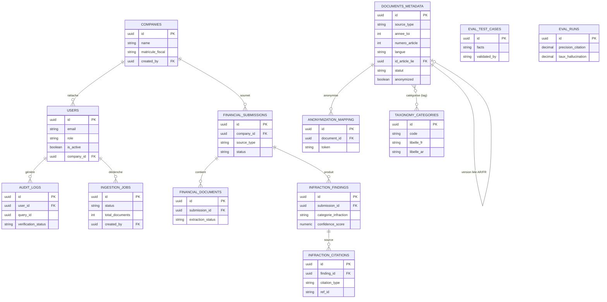
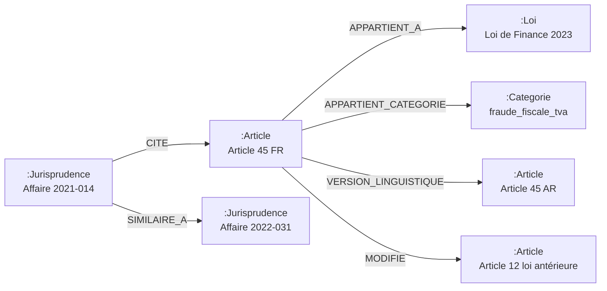

# Schéma de données détaillé — PostgreSQL, Neo4j, Qdrant

Complète [ARCHITECTURE.md](./ARCHITECTURE.md) (sections 4, 5, 9) avec le schéma exact des trois bases de données.

---

## 1. PostgreSQL — métadonnées, utilisateurs, audit (source de vérité)

### 1.1 `users`
```sql
CREATE TABLE users (
    id              UUID PRIMARY KEY DEFAULT gen_random_uuid(),
    email           VARCHAR(255) NOT NULL UNIQUE,
    hashed_password VARCHAR(255) NOT NULL,
    full_name       VARCHAR(255) NOT NULL,
    role            VARCHAR(20) NOT NULL CHECK (role IN ('citoyen', 'avocat', 'juge', 'admin', 'entreprise')),
    is_active       BOOLEAN NOT NULL DEFAULT TRUE,
    preferred_lang  VARCHAR(5) NOT NULL DEFAULT 'fr' CHECK (preferred_lang IN ('fr', 'ar')),
    company_id      UUID REFERENCES companies(id) ON DELETE SET NULL,  -- requis si role='entreprise'
    created_at      TIMESTAMPTZ NOT NULL DEFAULT now(),
    updated_at      TIMESTAMPTZ NOT NULL DEFAULT now()
);
CREATE INDEX idx_users_role ON users(role);
CREATE INDEX idx_users_company_id ON users(company_id);
```

> `entreprise` est le rôle principal du système (2026-09-09) : voir [ARCHITECTURE.md — section 1](./ARCHITECTURE.md#1-objectif-du-projet). Un utilisateur `entreprise` est rattaché à une `company` via `company_id`. Les rôles `citoyen`/`avocat`/`juge` restent supportés mais secondaires (usage à préciser).

### 1.1bis `companies`
```sql
CREATE TABLE companies (
    id                UUID PRIMARY KEY DEFAULT gen_random_uuid(),
    name              VARCHAR(255) NOT NULL,
    matricule_fiscal  VARCHAR(50) NOT NULL UNIQUE,
    secteur_activite  VARCHAR(255),
    created_by        UUID NOT NULL REFERENCES users(id),
    created_at        TIMESTAMPTZ NOT NULL DEFAULT now(),
    updated_at        TIMESTAMPTZ NOT NULL DEFAULT now()
);
CREATE UNIQUE INDEX idx_companies_matricule_fiscal ON companies(matricule_fiscal);
```

### 1.1ter `financial_submissions`, `financial_documents`, `infraction_findings`, `infraction_citations`
Une **soumission** représente un envoi (unique ou combiné) de la situation financière d'une société, sur lequel le pipeline multi-agents produit des **constats d'infraction** sourcés.
```sql
CREATE TABLE financial_submissions (
    id                  UUID PRIMARY KEY DEFAULT gen_random_uuid(),
    company_id          UUID NOT NULL REFERENCES companies(id) ON DELETE CASCADE,
    submitted_by        UUID NOT NULL REFERENCES users(id),
    source_type         VARCHAR(20) NOT NULL CHECK (source_type IN ('document', 'formulaire', 'texte_libre', 'mixte')),
    free_text           TEXT,
    structured_data     JSONB,                          -- champs du formulaire (CA, TVA collectée/déduite, etc. — non figé)
    status              VARCHAR(20) NOT NULL DEFAULT 'pending'
                        CHECK (status IN ('pending', 'analyzing', 'completed', 'failed')),
    final_summary       TEXT,
    verification_status VARCHAR(30),
    disclaimer          TEXT,
    created_at          TIMESTAMPTZ NOT NULL DEFAULT now(),
    updated_at          TIMESTAMPTZ NOT NULL DEFAULT now()
);
CREATE INDEX idx_fin_submissions_company ON financial_submissions(company_id);
CREATE INDEX idx_fin_submissions_status ON financial_submissions(status);

CREATE TABLE financial_documents (
    id                UUID PRIMARY KEY DEFAULT gen_random_uuid(),
    submission_id     UUID NOT NULL REFERENCES financial_submissions(id) ON DELETE CASCADE,
    original_filename VARCHAR(500) NOT NULL,
    storage_path      VARCHAR(1000) NOT NULL,
    mime_type         VARCHAR(100),
    size_bytes        INT NOT NULL DEFAULT 0,
    extraction_status VARCHAR(20) NOT NULL DEFAULT 'uploaded'
                      CHECK (extraction_status IN ('uploaded', 'processing', 'extracted', 'failed')),
    extracted_data    JSONB,
    extraction_error  TEXT,
    created_at        TIMESTAMPTZ NOT NULL DEFAULT now(),
    updated_at        TIMESTAMPTZ NOT NULL DEFAULT now()
);
CREATE INDEX idx_fin_documents_submission ON financial_documents(submission_id);

CREATE TABLE infraction_findings (
    id                   UUID PRIMARY KEY DEFAULT gen_random_uuid(),
    submission_id        UUID NOT NULL REFERENCES financial_submissions(id) ON DELETE CASCADE,
    categorie_infraction VARCHAR(100) NOT NULL,   -- code taxonomie, voir table taxonomy_categories
    description          TEXT NOT NULL,
    severite             VARCHAR(20),
    confidence_score     NUMERIC(5,4),
    created_at           TIMESTAMPTZ NOT NULL DEFAULT now()
);
CREATE INDEX idx_infraction_findings_submission ON infraction_findings(submission_id);
CREATE INDEX idx_infraction_findings_categorie ON infraction_findings(categorie_infraction);

CREATE TABLE infraction_citations (
    id             UUID PRIMARY KEY DEFAULT gen_random_uuid(),
    finding_id     UUID NOT NULL REFERENCES infraction_findings(id) ON DELETE CASCADE,
    citation_type  VARCHAR(20) NOT NULL CHECK (citation_type IN ('article', 'jurisprudence')),
    ref_id         VARCHAR(100) NOT NULL,   -- article_id ou case_id
    loi            VARCHAR(255),
    numero_article INT,
    reference      VARCHAR(255),
    statut         VARCHAR(50),
    langue         VARCHAR(5),
    extrait        TEXT NOT NULL
);
CREATE INDEX idx_infraction_citations_finding ON infraction_citations(finding_id);
```

> **Statut d'implémentation (2026-09-09)** : ces tables et les endpoints `/companies`, `/financial-submissions` sont implémentés (modèles SQLAlchemy + migration Alembic `20260909_0003` + routes CRUD). La génération effective des `infraction_findings`/`infraction_citations` par le pipeline multi-agents (Qualification → recherche → synthèse → vérification) **n'est pas encore câblée** — `POST /financial-submissions/{id}/analyze` bascule seulement le statut à `analyzing` pour l'instant.

### 1.2 `documents_metadata`
Table de vérité pour le statut légal — indépendante du vector store (Qdrant peut être réindexé sans perte d'information).
```sql
CREATE TABLE documents_metadata (
    id                  UUID PRIMARY KEY DEFAULT gen_random_uuid(),
    source_type         VARCHAR(20) NOT NULL CHECK (source_type IN ('loi', 'jurisprudence')),
    titre               VARCHAR(500) NOT NULL,
    annee_loi           INT,
    numero_article      INT,
    langue              VARCHAR(5) NOT NULL CHECK (langue IN ('fr', 'ar')),
    id_article_lie      UUID,                       -- pointe vers la version dans l'autre langue
    statut              VARCHAR(20) NOT NULL DEFAULT 'en_vigueur'
                        CHECK (statut IN ('en_vigueur', 'modifie', 'abroge')),
    date_entree_vigueur DATE,
    date_abrogation     DATE,
    categorie_infraction TEXT[],                     -- tags taxonomie
    ingestion_status    VARCHAR(20) NOT NULL DEFAULT 'uploaded'
                        CHECK (ingestion_status IN ('uploaded','ocr_en_cours','normalise','parse','indexe','erreur')),
    storage_path        VARCHAR(1000) NOT NULL,       -- chemin MinIO du document brut
    anonymized          BOOLEAN NOT NULL DEFAULT FALSE, -- true requis si source_type='jurisprudence'
    created_at          TIMESTAMPTZ NOT NULL DEFAULT now(),
    updated_at          TIMESTAMPTZ NOT NULL DEFAULT now()
);
CREATE INDEX idx_docs_statut ON documents_metadata(statut);
CREATE INDEX idx_docs_annee ON documents_metadata(annee_loi);
CREATE INDEX idx_docs_categorie ON documents_metadata USING GIN (categorie_infraction);
CREATE INDEX idx_docs_source_type ON documents_metadata(source_type);
```

### 1.3 `taxonomy_categories`
```sql
CREATE TABLE taxonomy_categories (
    id          UUID PRIMARY KEY DEFAULT gen_random_uuid(),
    code        VARCHAR(50) NOT NULL UNIQUE,   -- ex: 'fraude_fiscale_tva'
    libelle_fr  VARCHAR(255) NOT NULL,
    libelle_ar  VARCHAR(255) NOT NULL,
    description TEXT,
    created_at  TIMESTAMPTZ NOT NULL DEFAULT now()
);
```

### 1.4 `ingestion_jobs`
```sql
CREATE TABLE ingestion_jobs (
    id              UUID PRIMARY KEY DEFAULT gen_random_uuid(),
    status          VARCHAR(20) NOT NULL DEFAULT 'pending'
                    CHECK (status IN ('pending','running','completed','failed')),
    total_documents INT NOT NULL DEFAULT 0,
    processed_count INT NOT NULL DEFAULT 0,
    error_count     INT NOT NULL DEFAULT 0,
    started_at      TIMESTAMPTZ,
    finished_at     TIMESTAMPTZ,
    created_by      UUID REFERENCES users(id)
);
```

### 1.5 `audit_logs` (immuable — traçabilité judiciaire)
```sql
CREATE TABLE audit_logs (
    id                  UUID PRIMARY KEY DEFAULT gen_random_uuid(),
    user_id             UUID NOT NULL REFERENCES users(id),
    user_role           VARCHAR(20) NOT NULL,
    query_id            UUID NOT NULL,
    question            TEXT NOT NULL,
    final_answer        TEXT NOT NULL,
    citations           JSONB NOT NULL DEFAULT '[]',
    verification_status VARCHAR(20) NOT NULL,
    retry_count         INT NOT NULL DEFAULT 0,
    created_at          TIMESTAMPTZ NOT NULL DEFAULT now()
);
-- Aucune contrainte UPDATE/DELETE applicative : table append-only.
-- Recommandé : REVOKE UPDATE, DELETE ON audit_logs FROM app_role; (trigger de protection en Phase 5)
CREATE INDEX idx_audit_user ON audit_logs(user_id);
CREATE INDEX idx_audit_created ON audit_logs(created_at);
```

### 1.6 `eval_test_cases` et `eval_runs`
```sql
CREATE TABLE eval_test_cases (
    id                      UUID PRIMARY KEY DEFAULT gen_random_uuid(),
    facts                   TEXT NOT NULL,
    expected_category       TEXT[] NOT NULL,
    expected_article_ids    UUID[] NOT NULL,
    expected_answer_summary TEXT NOT NULL,
    validated_by            VARCHAR(255) NOT NULL,   -- nom du juriste validateur
    created_at              TIMESTAMPTZ NOT NULL DEFAULT now()
);

CREATE TABLE eval_runs (
    id                  UUID PRIMARY KEY DEFAULT gen_random_uuid(),
    precision_citation  NUMERIC(5,2),
    taux_hallucination  NUMERIC(5,2),
    recall_at_k         NUMERIC(5,2),
    taux_rejet_verifier NUMERIC(5,2),
    details             JSONB,
    created_at          TIMESTAMPTZ NOT NULL DEFAULT now()
);
```

### 1.7 Table de mapping d'anonymisation (accès restreint `admin`)
```sql
CREATE TABLE anonymization_mapping (
    id              UUID PRIMARY KEY DEFAULT gen_random_uuid(),
    document_id     UUID NOT NULL REFERENCES documents_metadata(id),
    token           VARCHAR(50) NOT NULL,        -- ex: 'PERSONNE_1'
    real_value_enc  BYTEA NOT NULL,              -- valeur réelle chiffrée (AES-GCM applicatif)
    created_at      TIMESTAMPTZ NOT NULL DEFAULT now()
);
-- Accès restreint via RBAC applicatif : uniquement rôle admin + justification légale loggée.
```

### 1.8 Diagramme entité-relation (vue d'ensemble)



> Note : la relation `DOCUMENTS_METADATA }o--o{ TAXONOMY_CATEGORIES` est un lien logique (via le tableau `categorie_infraction`), pas une clé étrangère stricte — représentée ici pour la lisibilité du modèle.

---

## 2. Neo4j — graphe légal

### 2.1 Labels de nœuds et propriétés

| Label | Propriétés clés |
|---|---|
| `Article` | `id` (UUID, unique), `numero`, `annee_loi`, `langue`, `statut`, `id_article_lie` |
| `Loi` | `id`, `nom` (ex: "Loi de Finance 2023"), `annee`, `date_publication` |
| `Jurisprudence` | `id`, `reference`, `date_decision`, `juridiction`, `anonymized` (bool) |
| `Categorie` | `id`, `code`, `libelle_fr`, `libelle_ar` |

### 2.2 Contraintes et index
```cypher
CREATE CONSTRAINT article_id_unique IF NOT EXISTS FOR (a:Article) REQUIRE a.id IS UNIQUE;
CREATE CONSTRAINT loi_id_unique IF NOT EXISTS FOR (l:Loi) REQUIRE l.id IS UNIQUE;
CREATE CONSTRAINT jurisprudence_id_unique IF NOT EXISTS FOR (j:Jurisprudence) REQUIRE j.id IS UNIQUE;
CREATE CONSTRAINT categorie_code_unique IF NOT EXISTS FOR (c:Categorie) REQUIRE c.code IS UNIQUE;

CREATE INDEX article_statut_idx IF NOT EXISTS FOR (a:Article) ON (a.statut);
CREATE INDEX article_annee_idx IF NOT EXISTS FOR (a:Article) ON (a.annee_loi);
```

### 2.3 Types de relations

| Relation | Sens | Propriétés |
|---|---|---|
| `(:Article)-[:APPARTIENT_A]->(:Loi)` | rattachement | — |
| `(:Article)-[:MODIFIE]->(:Article)` | amendement | `date_modification` |
| `(:Article)-[:ABROGE]->(:Article)` | abrogation | `date_abrogation` |
| `(:Article)-[:APPARTIENT_CATEGORIE]->(:Categorie)` | classification | — |
| `(:Jurisprudence)-[:CITE]->(:Article)` | citation légale dans une décision | `contexte` |
| `(:Jurisprudence)-[:SIMILAIRE_A]->(:Jurisprudence)` | similarité calculée a posteriori | `score` |
| `(:Article)-[:VERSION_LINGUISTIQUE]->(:Article)` | lien AR ↔ FR du même article | — |

### 2.4 Exemple de graphe instancié



### 2.5 Exemple de requête (contexte multi-sauts pour l'agent de recherche légale)
```cypher
MATCH (a:Article {id: $article_id})
OPTIONAL MATCH (a)-[:MODIFIE|ABROGE]-(lie:Article)
OPTIONAL MATCH (j:Jurisprudence)-[:CITE]->(a)
RETURN a, collect(DISTINCT lie) AS articles_lies, collect(DISTINCT j) AS jurisprudence_citante;
```

---

## 3. Qdrant — collections vectorielles

### 3.1 Collections
| Collection | Contenu | Dimension vecteur dense | Distance |
|---|---|---|---|
| `loi_finance` | Chunks d'articles de la loi de finance | 1024 (BGE-M3) | Cosine |
| `jurisprudence` | Résumés/chunks de décisions (anonymisées) | 1024 (BGE-M3) | Cosine |

Chaque collection est configurée en **mode hybride** : vecteur dense nommé `dense` + vecteur sparse nommé `sparse` (BGE-M3 sparse output), permettant une requête combinée native Qdrant (`query_points` avec fusion RRF).

### 3.2 Configuration (exemple `qdrant-client`)
```python
from qdrant_client.models import VectorParams, Distance, SparseVectorParams

client.create_collection(
    collection_name="loi_finance",
    vectors_config={"dense": VectorParams(size=1024, distance=Distance.COSINE)},
    sparse_vectors_config={"sparse": SparseVectorParams()},
)
```

### 3.3 Schéma du payload (par point / chunk)
```json
{
  "id_chunk": "lf2023_art45_fr",
  "id_article_lie": "lf2023_art45",
  "document_id": "uuid-postgres-documents_metadata",
  "annee_loi": 2023,
  "numero_article": 45,
  "langue": "fr",
  "statut": "en_vigueur",
  "categorie_infraction": ["fraude_fiscale", "tva"],
  "texte": "..."
}
```

### 3.4 Index de payload (filtrage rapide)
```python
client.create_payload_index("loi_finance", field_name="statut", field_schema="keyword")
client.create_payload_index("loi_finance", field_name="categorie_infraction", field_schema="keyword")
client.create_payload_index("loi_finance", field_name="langue", field_schema="keyword")
client.create_payload_index("loi_finance", field_name="annee_loi", field_schema="integer")
```

---

## 4. Cohérence entre les trois bases

- **`id_chunk` / `document_id`** relie chaque point Qdrant à une ligne `documents_metadata` (Postgres) — Postgres reste la source de vérité pour le `statut` légal (en cas de désaccord, Postgres prime, une tâche de synchronisation périodique met à jour le payload Qdrant).
- **`id` Neo4j `Article`** correspond au même UUID que `documents_metadata.id` — permet de faire des jointures applicatives simples entre le graphe et les métadonnées relationnelles.
- **Mise à jour du statut d'un article** (ex : abrogation par une nouvelle loi de finance) : une seule opération transactionnelle applicative met à jour Postgres, le payload Qdrant correspondant, et crée la relation `ABROGE` dans Neo4j.
