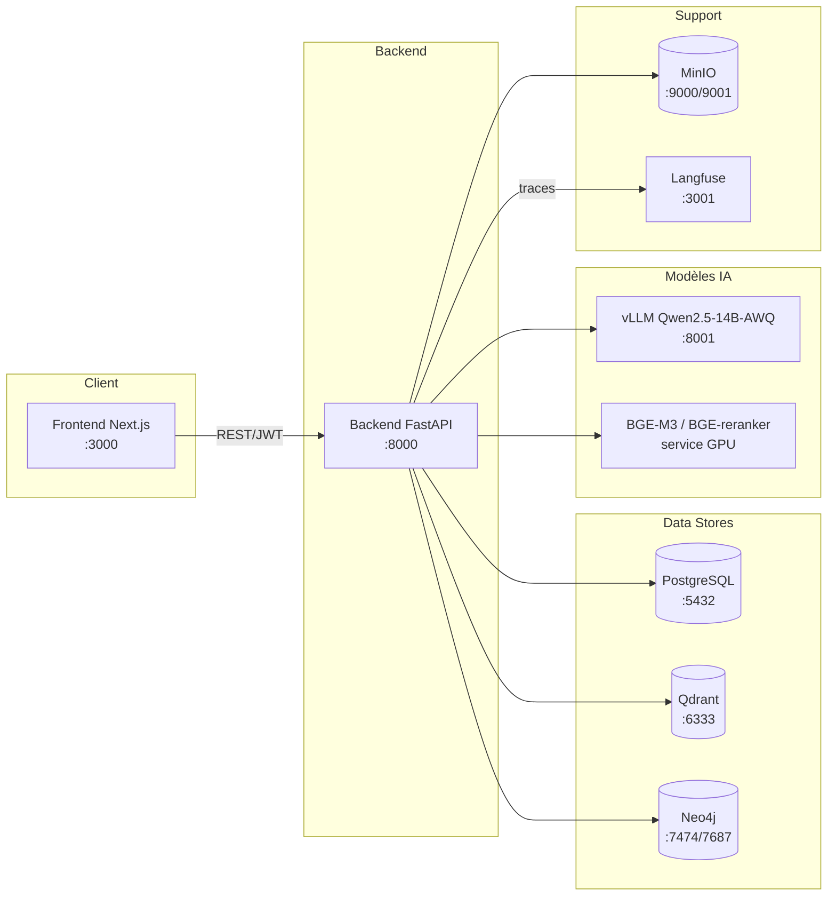

# Structure détaillée du projet — Arborescence complète et rôle de chaque fichier

Ce document détaille exhaustivement la section 9 de [ARCHITECTURE.md](ARCHITECTURE.md) : chaque dossier, chaque fichier, son rôle exact, et les dépendances/contenus attendus. Objectif : pouvoir scaffolder le projet sans ambiguïté.

---

## 1. Arborescence complète

```
low/
├── .env.example
├── .gitignore
├── README.md
├── ARCHITECTURE.md
├── STRUCTURE.md
├── docker-compose.yml
├── docker-compose.override.yml
├── Makefile
│
├── .github/
│   └── workflows/
│       ├── backend-ci.yml
│       └── frontend-ci.yml
│
├── backend/
│   ├── Dockerfile
│   ├── pyproject.toml
│   ├── requirements.txt
│   ├── requirements-dev.txt
│   ├── alembic.ini
│   ├── alembic/
│   │   ├── env.py
│   │   ├── script.py.mako
│   │   └── versions/
│   │       └── .gitkeep
│   ├── app/
│   │   ├── __init__.py
│   │   ├── main.py
│   │   │
│   │   ├── core/
│   │   │   ├── __init__.py
│   │   │   ├── config.py
│   │   │   ├── security.py
│   │   │   ├── logging.py
│   │   │   └── constants.py
│   │   │
│   │   ├── api/
│   │   │   ├── __init__.py
│   │   │   ├── deps.py
│   │   │   └── v1/
│   │   │       ├── __init__.py
│   │   │       ├── router.py
│   │   │       └── endpoints/
│   │   │           ├── __init__.py
│   │   │           ├── auth.py
│   │   │           ├── query.py
│   │   │           ├── documents.py
│   │   │           ├── users.py
│   │   │           └── health.py
│   │   │
│   │   ├── agents/
│   │   │   ├── __init__.py
│   │   │   ├── state.py
│   │   │   ├── graph.py
│   │   │   ├── orchestrator.py
│   │   │   ├── qualification.py
│   │   │   ├── legal_retrieval.py
│   │   │   ├── jurisprudence_retrieval.py
│   │   │   ├── reranker.py
│   │   │   ├── synthesis.py
│   │   │   ├── verifier.py
│   │   │   ├── formatter.py
│   │   │   └── prompts/
│   │   │       ├── __init__.py
│   │   │       ├── qualification_prompt.py
│   │   │       ├── synthesis_prompt.py
│   │   │       ├── verifier_prompt.py
│   │   │       └── formatter_prompt.py
│   │   │
│   │   ├── ingestion/
│   │   │   ├── __init__.py
│   │   │   ├── pipeline.py
│   │   │   ├── ocr.py
│   │   │   ├── normalization.py
│   │   │   ├── parsing.py
│   │   │   ├── metadata.py
│   │   │   ├── taxonomy.py
│   │   │   ├── alignment.py
│   │   │   ├── chunking.py
│   │   │   ├── embeddings.py
│   │   │   ├── graph_extraction.py
│   │   │   └── loaders/
│   │   │       ├── __init__.py
│   │   │       ├── pdf_loader.py
│   │   │       └── docx_loader.py
│   │   │
│   │   ├── retrieval/
│   │   │   ├── __init__.py
│   │   │   ├── qdrant_client.py
│   │   │   ├── neo4j_client.py
│   │   │   ├── hybrid_search.py
│   │   │   └── rerank.py
│   │   │
│   │   ├── llm/
│   │   │   ├── __init__.py
│   │   │   ├── vllm_client.py
│   │   │   └── embedding_client.py
│   │   │
│   │   ├── models/
│   │   │   ├── __init__.py
│   │   │   ├── schemas.py
│   │   │   ├── db_models.py
│   │   │   └── enums.py
│   │   │
│   │   ├── db/
│   │   │   ├── __init__.py
│   │   │   ├── session.py
│   │   │   └── init_db.py
│   │   │
│   │   └── services/
│   │       ├── __init__.py
│   │       ├── audit_log.py
│   │       └── auth_service.py
│   │
│   ├── scripts/
│   │   ├── run_ingestion.py
│   │   ├── create_test_dataset.py
│   │   └── evaluate.py
│   │
│   └── tests/
│       ├── conftest.py
│       ├── unit/
│       │   ├── test_chunking.py
│       │   ├── test_parsing.py
│       │   ├── test_hybrid_search.py
│       │   ├── test_verifier.py
│       │   └── test_taxonomy.py
│       └── integration/
│           ├── test_query_endpoint.py
│           └── test_ingestion_pipeline.py
│
├── frontend/
│   ├── Dockerfile
│   ├── package.json
│   ├── next.config.js
│   ├── tsconfig.json
│   ├── tailwind.config.ts
│   ├── postcss.config.js
│   ├── .env.local.example
│   ├── app/
│   │   ├── layout.tsx
│   │   ├── page.tsx
│   │   ├── globals.css
│   │   ├── (auth)/
│   │   │   ├── login/page.tsx
│   │   │   └── register/page.tsx
│   │   ├── chat/
│   │   │   └── page.tsx
│   │   └── admin/
│   │       └── documents/page.tsx
│   ├── components/
│   │   ├── ChatWindow.tsx
│   │   ├── MessageBubble.tsx
│   │   ├── CitationCard.tsx
│   │   ├── RoleSelector.tsx
│   │   ├── DocumentViewer.tsx
│   │   └── layout/
│   │       ├── Header.tsx
│   │       └── Sidebar.tsx
│   ├── lib/
│   │   ├── api-client.ts
│   │   ├── auth.ts
│   │   └── types.ts
│   └── styles/
│       └── globals.css
│
├── data/
│   ├── raw/
│   │   └── .gitkeep
│   ├── processed/
│   │   └── .gitkeep
│   └── eval/
│       └── test_cases.jsonl
│
└── infra/
    ├── qdrant/
    │   └── config.yaml
    ├── neo4j/
    │   └── neo4j.conf
    ├── vllm/
    │   └── serve_config.yaml
    ├── langfuse/
    │   └── .env.langfuse.example
    └── minio/
        └── .env.minio.example
```

---

## 2. Fichiers racine

| Fichier | Rôle |
|---|---|
| `.env.example` | Modèle de toutes les variables d'environnement nécessaires (voir section 7). À copier en `.env` (jamais commité). |
| `.gitignore` | Exclut `.env`, `data/raw/`, `data/processed/`, `node_modules/`, `__pycache__/`, `*.pyc`, volumes Docker, modèles téléchargés. |
| `README.md` | Présentation du projet, instructions d'installation (`docker compose up`), lien vers ARCHITECTURE.md et STRUCTURE.md. |
| `ARCHITECTURE.md` | Document d'architecture complet (déjà créé). |
| `STRUCTURE.md` | Ce document. |
| `docker-compose.yml` | Orchestration de tous les services (voir section 8). |
| `docker-compose.override.yml` | Overrides pour le développement local (hot-reload, ports exposés, volumes montés en bind mount). |
| `Makefile` | Commandes raccourcies : `make up`, `make ingest`, `make test`, `make eval`. |

---

## 3. Backend (`backend/`)

### 3.1 Fichiers de configuration
| Fichier | Rôle |
|---|---|
| `Dockerfile` | Image Python (base `python:3.11-slim`), installation `requirements.txt`, lancement `uvicorn app.main:app`. |
| `pyproject.toml` | Métadonnées projet, config `ruff`/`black`/`mypy`. |
| `requirements.txt` | Dépendances de production (voir liste section 6). |
| `requirements-dev.txt` | `pytest`, `pytest-asyncio`, `httpx`, `ruff`, `mypy`, `black`. |
| `alembic.ini` + `alembic/` | Migrations de schéma PostgreSQL (utilisateurs, logs d'audit, métadonnées documents). |

### 3.2 `app/main.py`
Point d'entrée FastAPI : instancie l'app, monte le router `api/v1`, configure CORS, middleware de logging, gestion des exceptions globales, healthcheck au démarrage (vérifie connexion Qdrant/Neo4j/Postgres/vLLM).

### 3.3 `app/core/` — configuration transverse
| Fichier | Rôle |
|---|---|
| `config.py` | Classe `Settings` (pydantic-settings) : lit toutes les variables d'environnement (URLs Qdrant/Neo4j/Postgres/vLLM, clés JWT, paramètres LLM). |
| `security.py` | Génération/validation JWT, hashing des mots de passe (bcrypt/argon2), dépendances FastAPI `get_current_user`, vérification RBAC (`require_role("juge")`). |
| `logging.py` | Configuration du logging structuré (JSON logs), intégration Langfuse. |
| `constants.py` | Enum `UserRole`, Enum `DocumentStatus` (`en_vigueur`/`modifie`/`abroge`), constantes de configuration (top-k retrieval, seuils de score). |

### 3.4 `app/api/` — couche HTTP
| Fichier | Rôle |
|---|---|
| `deps.py` | Dépendances FastAPI communes : session DB, client Qdrant, client Neo4j, utilisateur courant. |
| `v1/router.py` | Agrège tous les sous-routers (`auth`, `query`, `documents`, `users`, `health`) sous `/api/v1`. |
| `endpoints/auth.py` | `POST /auth/login`, `POST /auth/register` (register réservé admin pour juges/avocats). |
| `endpoints/query.py` | `POST /query` — endpoint principal : reçoit `{user_role, question}`, invoque le graphe LangGraph, retourne `{final_answer, citations, verification_status}`. |
| `endpoints/documents.py` | Endpoints admin : upload de nouveaux documents à ingérer, déclenchement pipeline, consultation statut d'indexation. |
| `endpoints/users.py` | Gestion des comptes (admin uniquement). |
| `endpoints/health.py` | `GET /health` — vérifie connectivité Qdrant/Neo4j/Postgres/vLLM. |

### 3.5 `app/agents/` — cœur multi-agents (LangGraph)
| Fichier | Rôle |
|---|---|
| `state.py` | Définition de `AgentState` (TypedDict, voir ARCHITECTURE.md section 7.1). |
| `graph.py` | Construction du `StateGraph` : ajoute chaque agent comme nœud, définit les arêtes (y compris l'arête conditionnelle de re-recherche depuis le Vérificateur), compile le graphe exécutable. |
| `orchestrator.py` | Nœud d'entrée : initialise l'état, route selon `user_role`. |
| `qualification.py` | Extraction des faits + catégorie(s) d'infraction (appel LLM + mapping taxonomie). |
| `legal_retrieval.py` | Appelle `retrieval/hybrid_search.py` sur la collection `loi_finance`, filtré `statut=en_vigueur`. |
| `jurisprudence_retrieval.py` | Idem sur la collection `jurisprudence`. |
| `reranker.py` | Applique `retrieval/rerank.py` sur les résultats fusionnés des deux agents de recherche. |
| `synthesis.py` | Construit le prompt de synthèse (faits + articles + jurisprudence + contexte graphe) et appelle `llm/vllm_client.py`. |
| `verifier.py` | Vérifie que chaque citation dans `draft_answer` correspond à un document réellement récupéré et que son `statut` est `en_vigueur` ; met à jour `verification_status`. |
| `formatter.py` | Reformate `draft_answer` selon `user_role` (citoyen/avocat/juge). |
| `prompts/*.py` | Templates de prompts (system + few-shot) pour chaque agent LLM, séparés du code pour faciliter l'itération. |

### 3.6 `app/ingestion/` — pipeline d'indexation (offline)
| Fichier | Rôle |
|---|---|
| `pipeline.py` | Orchestration bout-en-bout : intake → OCR → normalisation → parsing → métadonnées → alignement → chunking → embeddings → indexation Qdrant/Neo4j. |
| `ocr.py` | Wrapper Tesseract (ara/fra séparés) + fallback Surya OCR (GPU). |
| `normalization.py` | Normalisation arabe (camel-tools) et française. |
| `parsing.py` | Extraction hiérarchie Titre/Chapitre/Section/Article via règles regex spécifiques au format tunisien. |
| `metadata.py` | Extraction/assignation des champs de métadonnées (année, statut, dates). |
| `taxonomy.py` | Définition de la taxonomie des infractions financières (voir ARCHITECTURE.md section 6) + fonction de classification (règles + LLM léger). |
| `alignment.py` | Liaison des articles AR ↔ FR via `id_article_lie`. |
| `chunking.py` | Découpage par article, gestion des articles longs avec overlap. |
| `embeddings.py` | Génération des vecteurs denses + sparses via BGE-M3, upsert dans Qdrant. |
| `graph_extraction.py` | Extraction des relations (`MODIFIE`, `ABROGE`, `CITE`, `APPARTIENT_A`) et écriture dans Neo4j. |
| `loaders/pdf_loader.py`, `loaders/docx_loader.py` | Extraction de texte natif selon le format source. |

### 3.7 `app/retrieval/` — accès aux stores de recherche
| Fichier | Rôle |
|---|---|
| `qdrant_client.py` | Wrapper client Qdrant (connexion, recherche dense/sparse, filtres payload). |
| `neo4j_client.py` | Wrapper driver Neo4j (requêtes Cypher pour contexte relationnel). |
| `hybrid_search.py` | Fusion RRF (Reciprocal Rank Fusion) des résultats dense + sparse. |
| `rerank.py` | Appel du modèle BGE-reranker-v2-m3 sur les résultats fusionnés. |

### 3.8 `app/llm/`
| Fichier | Rôle |
|---|---|
| `vllm_client.py` | Client HTTP vers le serveur vLLM (API compatible OpenAI) pour Qwen2.5-32B-Instruct. |
| `embedding_client.py` | Client vers le service d'embeddings BGE-M3 (dense + sparse). |

### 3.9 `app/models/`
| Fichier | Rôle |
|---|---|
| `schemas.py` | Modèles Pydantic pour requêtes/réponses API (`QueryRequest`, `QueryResponse`, `CitationSchema`). |
| `db_models.py` | Modèles SQLAlchemy : `User`, `AuditLog`, `DocumentMetadata`. |
| `enums.py` | Enums partagés (rôles, statuts, catégories). |

### 3.10 `app/db/`
| Fichier | Rôle |
|---|---|
| `session.py` | Création de l'engine SQLAlchemy et des sessions (async). |
| `init_db.py` | Initialisation des tables au démarrage (dev) / vérification connexion. |

### 3.11 `app/services/`
| Fichier | Rôle |
|---|---|
| `audit_log.py` | Enregistrement immuable de chaque requête utilisateur + réponse + sources citées. |
| `auth_service.py` | Logique métier d'authentification (création utilisateur, vérification mot de passe). |

### 3.12 `scripts/`
| Fichier | Rôle |
|---|---|
| `run_ingestion.py` | Script CLI pour lancer `ingestion/pipeline.py` sur un dossier de documents. |
| `create_test_dataset.py` | Aide à la constitution du jeu de test (10-20 cas validés par juriste). |
| `evaluate.py` | Exécute le jeu de test contre le pipeline complet et calcule les métriques (précision de citation, taux d'hallucination, recall@k). |

### 3.13 `tests/`
- `unit/` : tests isolés (chunking, parsing, hybrid search, vérificateur, taxonomie).
- `integration/` : tests bout-en-bout (endpoint `/query`, pipeline d'ingestion complet sur données factices).
- `conftest.py` : fixtures partagées (client de test FastAPI, DB de test, mocks Qdrant/Neo4j/vLLM).

---

## 4. Frontend (`frontend/`)

| Fichier/dossier | Rôle |
|---|---|
| `Dockerfile` | Image Node, build Next.js, lancement en mode production. |
| `package.json` | Dépendances (voir section 6). |
| `next.config.js` | Configuration Next.js (proxy API, variables publiques). |
| `tsconfig.json` | Configuration TypeScript. |
| `tailwind.config.ts` / `postcss.config.js` | Configuration Tailwind CSS. |
| `.env.local.example` | Variable `NEXT_PUBLIC_API_URL` etc. |
| `app/layout.tsx` | Layout global (Header, Sidebar, provider d'authentification). |
| `app/page.tsx` | Page d'accueil / redirection login. |
| `app/(auth)/login/page.tsx` | Formulaire de connexion. |
| `app/(auth)/register/page.tsx` | Formulaire de création de compte (admin). |
| `app/chat/page.tsx` | Interface principale de requête (chat + affichage citations). |
| `app/admin/documents/page.tsx` | Gestion des documents à ingérer (upload, statut). |
| `components/ChatWindow.tsx` | Composant conteneur du fil de conversation. |
| `components/MessageBubble.tsx` | Affichage d'un message utilisateur/système. |
| `components/CitationCard.tsx` | Carte affichant une citation (article, année, statut, lien vers texte source). |
| `components/RoleSelector.tsx` | Sélecteur de profil (avocat/juge/citoyen) influençant le format de réponse. |
| `components/DocumentViewer.tsx` | Visionneuse du document source cité. |
| `components/layout/Header.tsx`, `Sidebar.tsx` | Navigation. |
| `lib/api-client.ts` | Wrapper `fetch`/`axios` vers le backend FastAPI. |
| `lib/auth.ts` | Gestion du token JWT côté client. |
| `lib/types.ts` | Types TypeScript partagés (miroir des schémas Pydantic). |

---

## 5. Données (`data/`)

| Dossier | Rôle |
|---|---|
| `raw/` | Documents bruts déposés avant traitement (gitignored, volumineux). |
| `processed/` | Sorties intermédiaires du pipeline (texte structuré, JSON de chunks) — utile pour debug/réindexation sans refaire l'OCR. |
| `eval/test_cases.jsonl` | Jeu de test de référence (10-20 cas), un cas par ligne JSON : `{"facts": "...", "expected_category": "...", "expected_articles": [...], "expected_answer_summary": "..."}`. |

---

## 6. Dépendances principales

### Backend (`requirements.txt`)
```
fastapi
uvicorn[standard]
pydantic
pydantic-settings
sqlalchemy
asyncpg
alembic
langgraph
langchain-core
qdrant-client
neo4j
FlagEmbedding          # BGE-M3 + BGE-reranker
pytesseract
python-docx
pypdf
camel-tools
python-jose[cryptography]   # JWT
passlib[bcrypt]
httpx
langfuse
```

### Frontend (`package.json` — dépendances clés)
```
next
react / react-dom
typescript
tailwindcss
axios
zustand ou react-query   # gestion d'état/cache des requêtes
```

---

## 7. Variables d'environnement (`.env.example`)

```
# PostgreSQL
POSTGRES_USER=raguser
POSTGRES_PASSWORD=changeme
POSTGRES_DB=legal_rag
POSTGRES_HOST=postgres
POSTGRES_PORT=5432

# Qdrant
QDRANT_HOST=qdrant
QDRANT_PORT=6333

# Neo4j
NEO4J_URI=bolt://neo4j:7687
NEO4J_USER=neo4j
NEO4J_PASSWORD=changeme

# vLLM (LLM self-hosted)
VLLM_BASE_URL=http://vllm:8000/v1
VLLM_MODEL_NAME=Qwen2.5-32B-Instruct

# Embeddings
EMBEDDING_MODEL_NAME=BAAI/bge-m3
RERANKER_MODEL_NAME=BAAI/bge-reranker-v2-m3

# Auth
JWT_SECRET_KEY=changeme
JWT_ALGORITHM=HS256
JWT_EXPIRE_MINUTES=60

# Langfuse
LANGFUSE_PUBLIC_KEY=
LANGFUSE_SECRET_KEY=
LANGFUSE_HOST=http://langfuse:3000

# MinIO (stockage documents bruts)
MINIO_ENDPOINT=minio:9000
MINIO_ACCESS_KEY=changeme
MINIO_SECRET_KEY=changeme
```

---

## 8. Services `docker-compose.yml`

| Service | Image/base | Rôle | Port |
|---|---|---|---|
| `backend` | build `backend/Dockerfile` | API FastAPI + agents LangGraph | 8000 |
| `frontend` | build `frontend/Dockerfile` | Interface Next.js | 3000 |
| `postgres` | `postgres:16` | Métadonnées, utilisateurs, audit | 5432 |
| `qdrant` | `qdrant/qdrant` | Recherche vectorielle hybride | 6333 |
| `neo4j` | `neo4j:5` | Graphe légal | 7474 / 7687 |
| `vllm` | `vllm/vllm-openai` | Serveur LLM self-hosted (Qwen2.5-14B-Instruct-AWQ) | 8001 |
| `minio` | `minio/minio` | Stockage documents bruts | 9000 / 9001 |
| `langfuse` | `langfuse/langfuse` | Observabilité des agents/LLM | 3001 |

### 8.1 Diagramme de déploiement



---

## 9. CI (`.github/workflows/`)

| Fichier | Rôle |
|---|---|
| `backend-ci.yml` | Lint (`ruff`), typage (`mypy`), tests (`pytest`) à chaque PR sur `backend/`. |
| `frontend-ci.yml` | Lint (`eslint`), build (`next build`) à chaque PR sur `frontend/`. |
